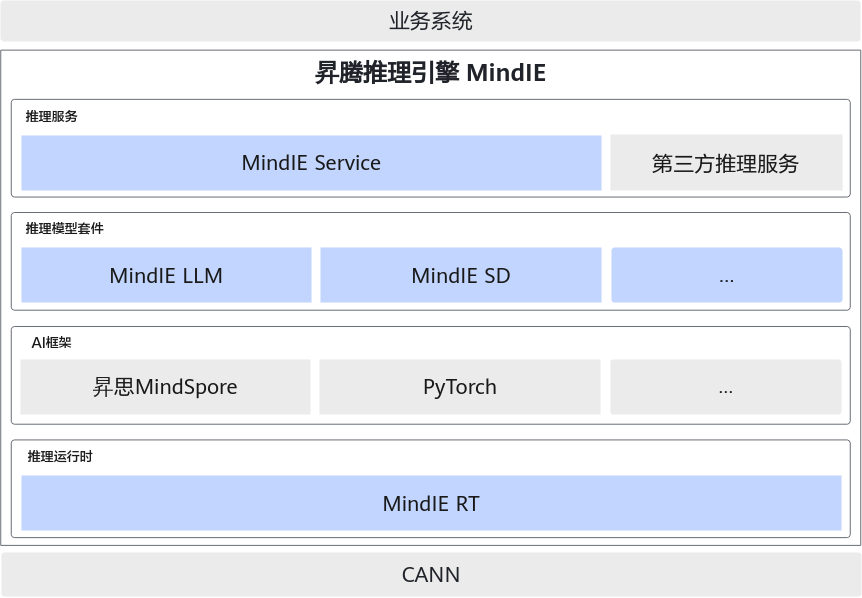

# 昇腾学习笔记

> 华为昇腾 AI 硬件生态学习记录。

## 昇腾仓库

- 昇腾仓库: [Link](https://gitee.com/ascend)

  - **MindSpeed-LLM**：原仓名 ModelLink，作为昇腾大模型训练框架，旨在为华为[昇腾芯片](https://www.hiascend.com/)提供端到端的大语言模型训练方案，包含分布式预训练、分布式指令微调、分布式偏好对齐以及对应的开发工具链。[Link](https://gitee.com/ascend/MindSpeed-LLM)

  - **MindSpeed**：针对华为[昇腾设备](https://www.hiascend.com/)的大模型加速库。[Link](https://gitee.com/ascend/MindSpeed)

## MindSpore 仓库

- MindSpore仓库: [Link](https://gitee.com/mindspore)

  - **MindFormers**：MindSpore Transformers 套件的目标是构建一个大模型训练、微调、评估、推理、部署的全流程开发套件，提供业内主流的 Transformer 类预训练模型和 SOTA 下游任务应用，涵盖丰富的并行特性。期望帮助用户轻松的实现大模型训练和创新研发。[Link](https://gitee.com/mindspore/mindformers)

## MindIE 推理引擎

> MindIE（Mind Inference Engine，昇腾推理引擎）是华为昇腾针对 AI 全场景业务的推理加速套件。

### 附录

- ATB Models：Ascend Transformer Boost Models
