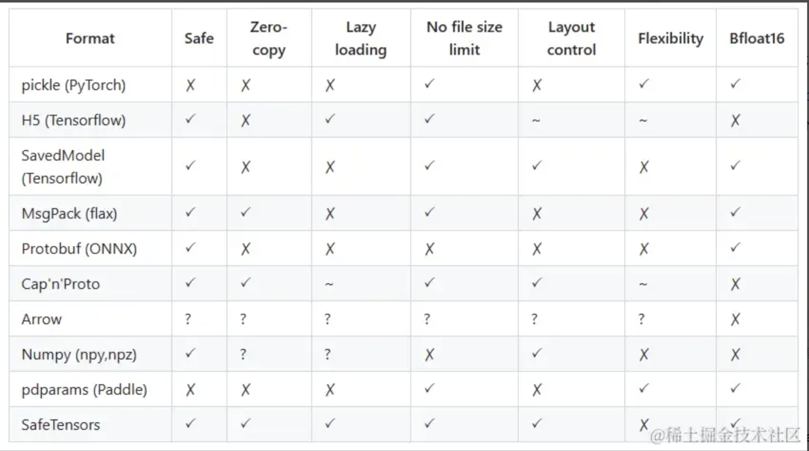

| 格式          | 介绍  |                      |
| ----------- | --- | -------------------- |
| GGUF        |     | [Link](#gguf)        |
| Safetensors |     | [Link](#safetensors) |
| ONNX        |     | [Link](#onnx)        |

## GGUF

<a name="gguf">:anchor:</a>

> GGUF（GPT-Generated Unified Format）是由 Georgi Gerganov（著名开源项目llama.cpp的创始人）定义发布的一种大模型文件格式。GGUF 继承自其前身 GGML，但 GGML 格式有一些缺点，已被完全弃用并被 GGUF 格式取代。GGUF 是一种二进制格式文件的规范，原始的大模型预训练结果经过转换后变成 GGUF 格式可以更快地被载入使用，也会消耗更低的资源。原因在于 GGUF 采用了多种技术来保存大模型预训练结果，包括采用紧凑的二进制编码格式、优化的数据结构、内存映射等。

- 一文搞懂大模型文件存储格式新宠GGUF [Link](https://juejin.cn/post/7408858126042726435)

## Safetensors

<a name="safetensors">:anchor:</a>

> Safetensors 是一种用于安全地存储张量的新格式，非常简单，但速度仍然很快（零拷贝）。它是 `pickle` 格式的替代品，因为，`pickle` 格式不安全，可能包含可以执行的恶意代码。

- 一文详解模型权重存储新格式 Safetensors [Link](https://juejin.cn/post/7386360803039838235)

## ONNX

<a name="onnx">:anchor:</a>

> **ONNX**（英语：Open Neural Network Exchange）是一种针对机器学习所设计的开放式的文件格式，用于存储训练好的模型。它使得不同的人工智能框架（如Pytorch、MXNet）可以采用相同格式存储模型数据并交互。 ONNX的规范及代码主要由[微软](https://zh.wikipedia.org/wiki/%E5%BE%AE%E8%BD%AF "微软")，[亚马逊](https://zh.wikipedia.org/wiki/%E4%BA%9E%E9%A6%AC%E9%81%9C%E5%85%AC%E5%8F%B8 "亚马逊公司")，[Facebook](https://zh.wikipedia.org/wiki/Facebook "Facebook")和[IBM](https://zh.wikipedia.org/wiki/IBM "IBM")等公司共同开发，以开放源代码的方式托管在[Github](https://zh.wikipedia.org/wiki/Github "Github")上。目前官方支持加载ONNX模型并进行推理的深度学习框架有： Caffe2, [PyTorch](https://zh.wikipedia.org/wiki/PyTorch "PyTorch"), [MXNet](https://zh.wikipedia.org/wiki/MXNet "MXNet")，[ML.NET](https://zh.wikipedia.org/w/index.php?title=ML.NET&action=edit&redlink=1 "ML.NET（页面不存在）")，TensorRT 和 Microsoft CNTK，并且 [TensorFlow](https://zh.wikipedia.org/wiki/TensorFlow "TensorFlow") 也非官方的支持ONNX。 ---维基百科

## 附录

- 大模型常见存储格式
  
  

- 
