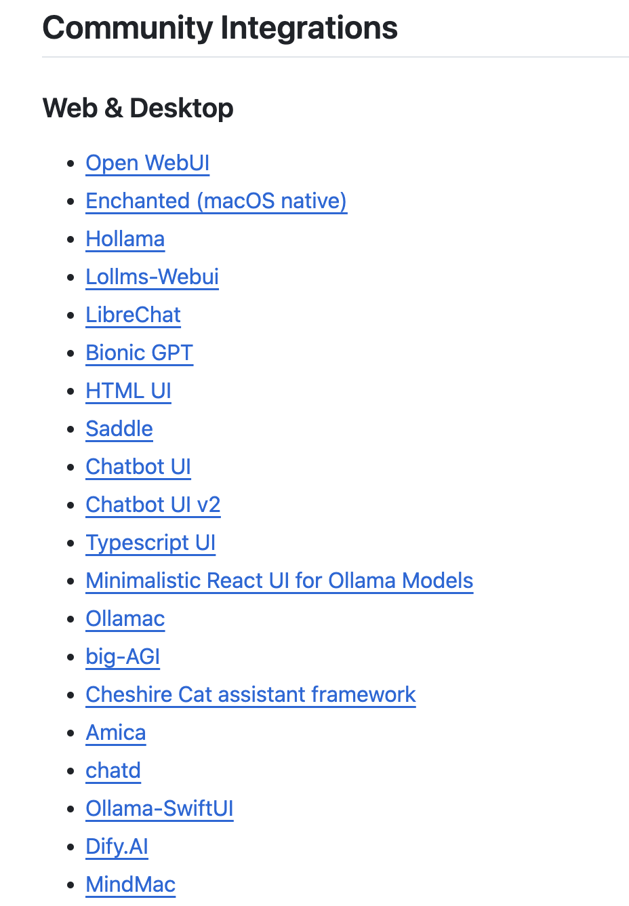

## AI平台

### Ollama

> Get up and running with Llama 3.3, DeepSeek-R1, Phi-4, Gemma 2, and other large language models. [官网](https://ollama.com/)

仓库地址: [Ollama](https://github.com/ollama/ollama)

支持丰富的集成应用, 如下图所示:

### Hugging Face

> [hf-mirror.com](https://hf-mirror.com/): 用于镜像 [huggingface.co](https://huggingface.co/) 域名, 致力于帮助国内AI开发者快速、稳定的下载模型、数据集

### HF-Mirror

> 本站域名 [hf-mirror.com](https://hf-mirror.com/)，用于镜像 [huggingface.co](https://huggingface.co/) 域名。作为一个公益项目，致力于帮助国内AI开发者快速、稳定的下载模型、数据集。捐赠支持请看网页左下角，感谢支持！

## AI公司

### Groq

Groq 成立于2016年，是一家 AI 芯片公司由前谷歌员工 Jonathan Ross 创立。其推出的LPU（Language Processing Unit）推理引擎是一种新型的端到端处理单元系统，可为具有顺序组件的计算密集型应用程序提供最快的推理，宣称做到了“地表最强推理”。[官网](https://groq.com/)
